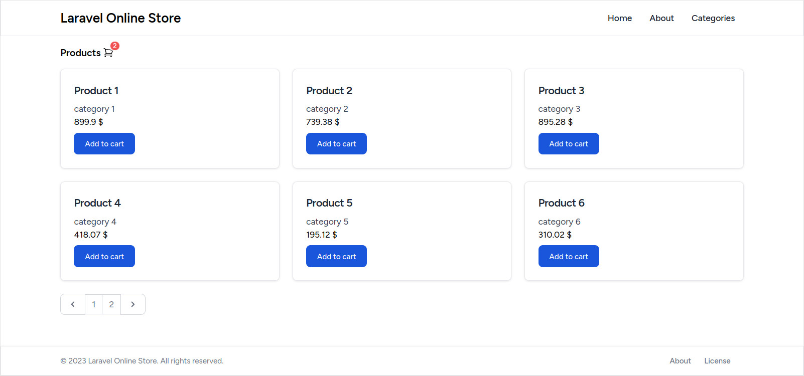

# laravel-online-store

Shopping cart example.



## Install

```sh
composer install
pnpm install

pnpm run build
cp .env.example .env
php artisan key:generate
php artisan migrate --seed
```

## Usage

```sh
php artisan serve
```
